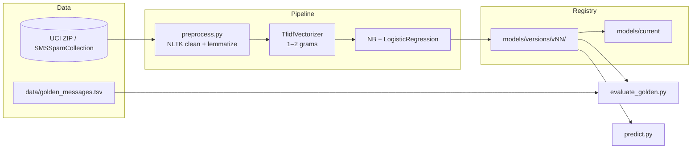
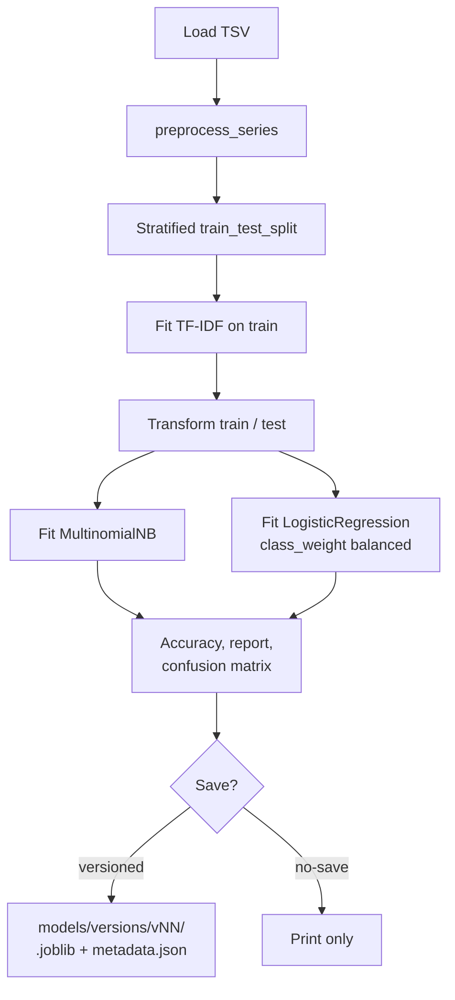
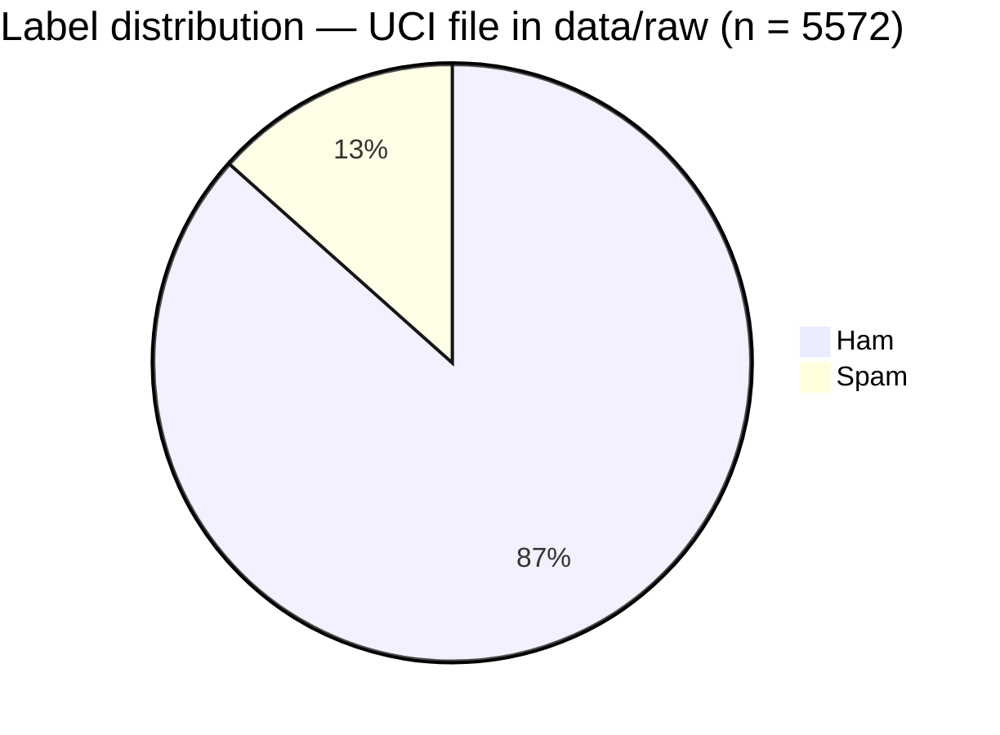
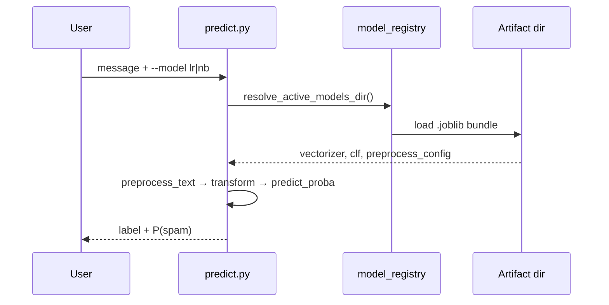

# SMS Spam Classification

End-to-end **ham vs. spam** classification for short messages, built around the [UCI SMS Spam Collection](https://archive.ics.uci.edu/dataset/228/sms+spam+collection). The default stack is **TF–IDF** features with two **scikit-learn** baselines (**Multinomial Naive Bayes** and **class-balanced Logistic Regression**), plus optional **sentence-transformer** embeddings for comparison.

Design goals: **reproducible training**, **versioned artifacts**, and **spam recall** awareness (missing spam is often worse than a false alarm in filter scenarios).

---

## How the system fits together



---

## Training pipeline (baseline)

Raw lines are `label<TAB>text` (`ham` / `spam`). After preprocessing, text is vectorized and both classifiers are fit on the same split. Metrics and hyperparameters are stored in **`metadata.json`** per version.



### Class balance (full corpus, *n* = 5,572)



---

## Inference and model resolution

`predict.py` loads vectorizer, chosen classifier, and preprocessing config. The **active model directory** is resolved in this order:

1. Explicit `--models-dir`
2. `--version` → `models/versions/<version>/`
3. Contents of `models/current` → `models/versions/<name>/`
4. Legacy flat layout: `models/*.joblib` at the project `models/` root



---

## Example metrics (versioned run)

Figures below come from `models/versions/v01/metadata.json` (hold-out split: *test_size* = 0.2, *random_state* = 42). Your numbers will match this only when the dataset hash and hyperparameters match.

| Model | Accuracy | Spam precision | Spam recall | Spam F1 |
|--------|----------|----------------|-------------|---------|
| Multinomial NB | 0.981 | 0.98 | 0.87 | 0.93 |
| Logistic regression | 0.976 | 0.90 | 0.93 | 0.91 |

Confusion matrices are stored in metadata as `[[TN, FP], [FN, TP]]` with rows **true** and columns **predicted** (0 = ham, 1 = spam).

---

## Repository layout

| Path | Role |
|------|------|
| `data/raw/SMSSpamCollection` | UCI-format source file (downloaded if missing when training) |
| `data/golden_messages.tsv` | Small labeled set for regression / smoke checks |
| `models/versions/vNN/` | Versioned `*.joblib` + `metadata.json` |
| `models/current` | Text file pointing at the default version (e.g. `v01`) |
| `src/train.py` | Train, evaluate on hold-out, save bundles |
| `src/predict.py` | CLI inference |
| `src/preprocess.py` | NLTK tokenization, optional stopwords, lemmatization |
| `src/load_data.py` | Load TSV + optional UCI download |
| `src/model_registry.py` | Versioning, metadata, path resolution |
| `src/evaluate_golden.py` | Metrics on golden TSV |
| `src/compare_versions.py` | Compare two versions on the same golden file |
| `src/train_bert_extension.py` | Optional **sentence-transformers** + LR comparison |
| `src/data_profile.py` | Text length / token summaries (library API) |
| `notebooks/spam_classifier_step_by_step.ipynb` | Walkthrough and experiments |
| `tests/` | Pytest suite |

---

## Setup

```bash
cd classify_messages_as_spam_or_not_spam
python -m venv .venv
source .venv/bin/activate   # Windows: .venv\Scripts\activate
pip install -r requirements.txt
```

First training run may download NLTK data and, if `data/raw/SMSSpamCollection` is absent, the UCI archive.

---

## Quickstart

**Train** and save the next version under `models/versions/` (optionally pin the version and set the current pointer):

```bash
python src/train.py --set-current --note "baseline"
```

**Classify** one message (uses `models/current` or legacy flat models if configured):

```bash
python src/predict.py "Win a free prize now!!!" --model lr
```

**Evaluate** on the golden file:

```bash
python src/evaluate_golden.py
```

**Compare** two trained versions:

```bash
python src/compare_versions.py v01 v02 --model lr
```

**BERT-style extension** (heavier: PyTorch + `sentence-transformers`):

```bash
python src/train_bert_extension.py --help
```

---

## Tests

```bash
pytest tests/ -q
```

---

## License and data

Model code in this repository is yours to use under your chosen license. The **SMS Spam Collection** dataset has its own terms via the [UCI page](https://archive.ics.uci.edu/dataset/228/sms+spam+collection); cite or comply with their requirements when redistributing the raw data.
